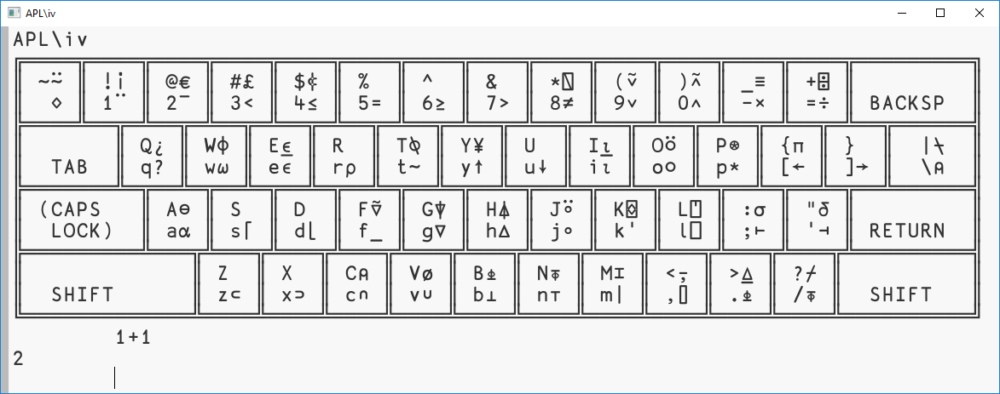

# cmd/lui - a gui front-end
<p align="center" >
  <br/>
</p>

Lui is a gui frontend to APL\iv
```
     lui          ui mode
     lui -a ARGS  cmd/apl mode
     lui -i ARGS  cmd/iv mode
     lui -z ZIP   attach zip file
```

Lui embedds all libraries in this repository and can be used in the terminal similar to cmd/apl and cmd/iv or as a gui application.

## Multiline expressions
When pressing the ENTER key, the current line is interpreted and the result is appended to the end of the editor.
ESC toggles hold mode, which prevents execution to edit multiple lines.

## Commands
Some packages provide commands that start with a slash or backslash as the first token, which is not valid APL.
The rewrite the tokens of the current line.

There is a built-in sam editor with the `/e` command.
To edit the definition of a lambda function stored in the variable `f`, do:
```
	f←{⍺+⍵}
	/e`f	
```

Commands are recursive.
To see the help text searchable in the editor, type `/e/h`

## ui customization
Lui is built on top of the ktye/ui toolkit.
The user interface can be changed at runtime using package `aplextra/u`.
See the documentation of package `u` for examples.

## Attach application (TODO)
Lui builds as a single static binary including APL385 font.
Custom startup code can be attached to the binary in a zip file,
that can be used to create a self-contained APL application with a custom user interface bundled with data.

## Installation
```
	go get github.com/ktye/iv/cmd/lui
	go install github.com/ktye/iv/cmd/lui
```
On windows, build with: `go build -ldflags -H=windowsgui`
